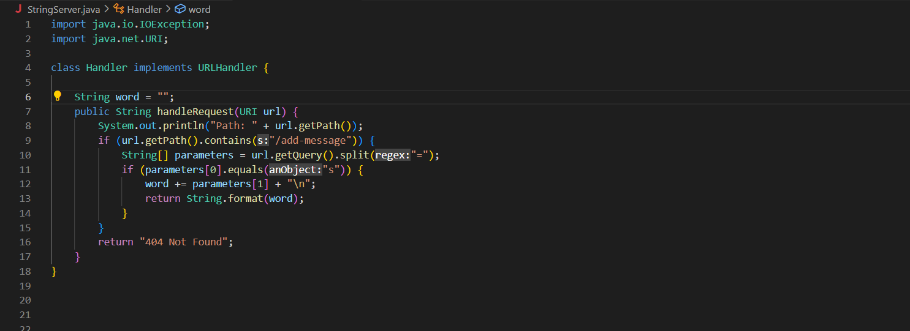
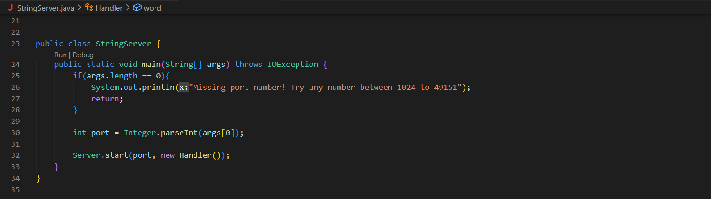
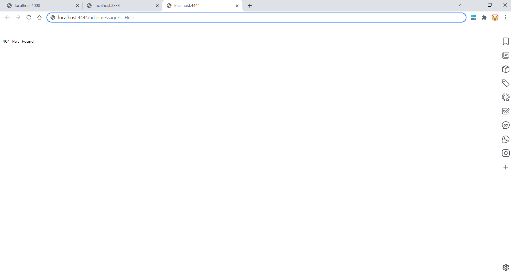
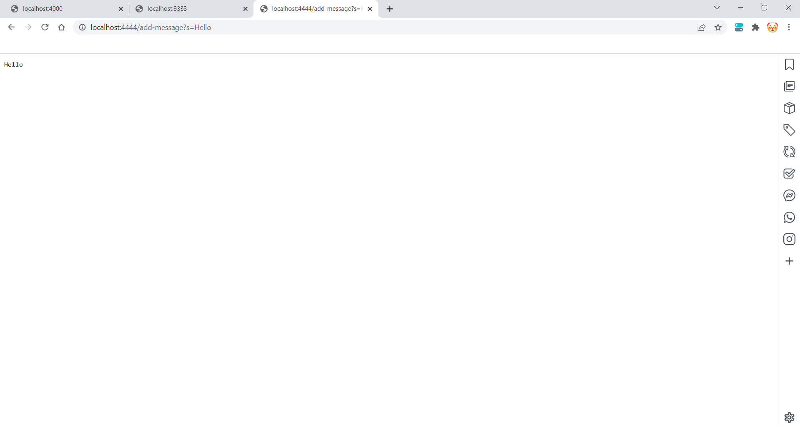
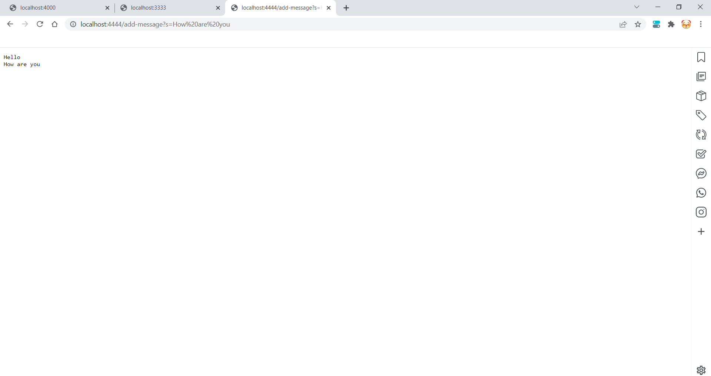
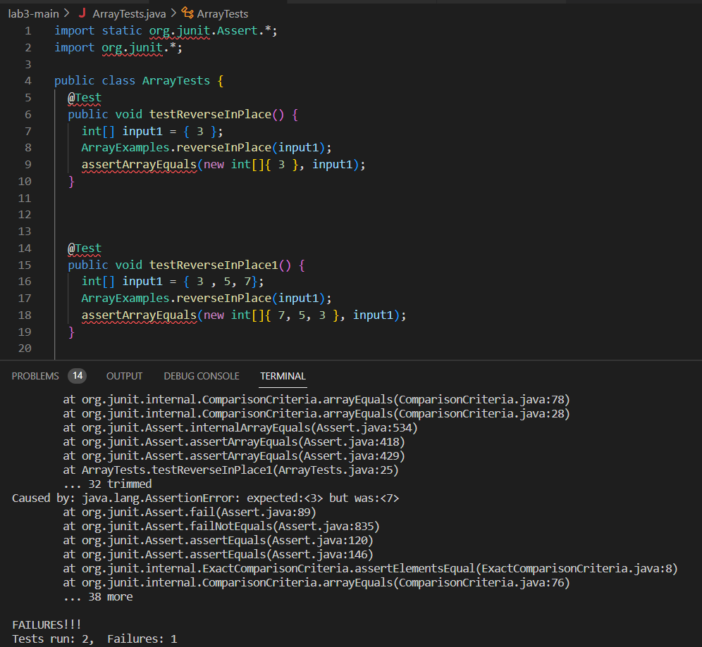
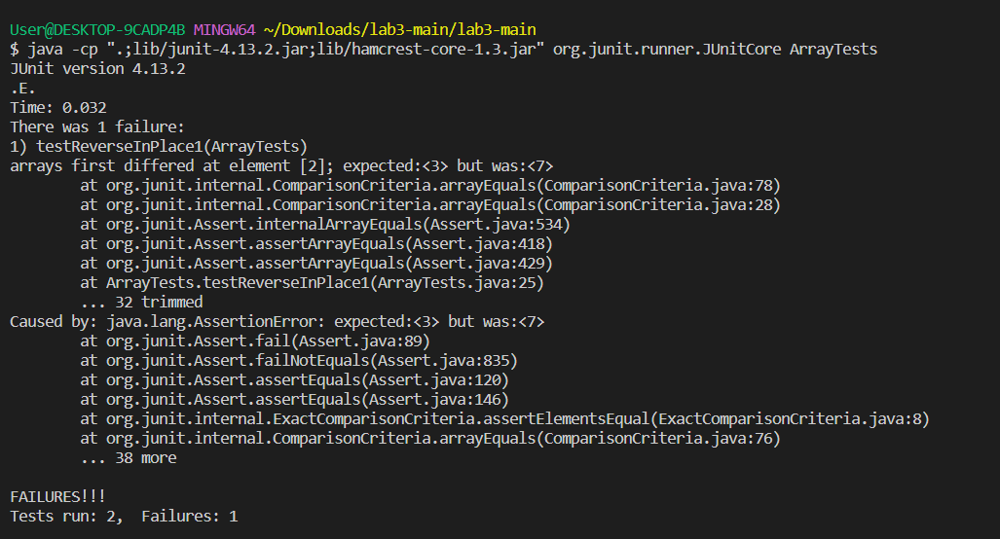

# Lab Report 2 

## Part 1: String Server

**String Server Code**



In the class `Handler` which implements `URL Handler` we have the method `handleRequest` which is used to add strings to the web server. `handleRequest` gets the path from the url and checks if it contains `/add-message`. If the url does indeed contain `/add-message` when the request `/add-message?s=<string>` is made the web server will update with the string that is after the equal sign. The class `StringServer` is also on this file, and this class is used to create the web server. 

**Web server page before `/add-message?s=<string>`:****


**Web server page when `/add-message?s=Hello` is entered:** 


**Web server page when `/add-message?s=How are you` is entered** 


## Part 2: Bugs
In the class `ArrayExamples` the method `reverseInPlace` has an error occur whenever it is used on an array that has two or more arrays.

**Failure-Inducing Input:**
```
@Test 
public void testReverseInPlace1() {
    int[] input1 = { 3 , 5, 7};
    ArrayExamples.reverseInPlace(input1);
    assertArrayEquals(new int[]{ 7, 5, 3 }, input1);
    }
  ```
  
**Input that runs correctly**
```
@Test 
public void testReverseInPlace() {
    int[] input1 = { 3 };
    ArrayExamples.reverseInPlace(input1);
    assertArrayEquals(new int[]{ 3 }, input1);
    }
  ```
  **Symptom:** 
  
  **Symptom Terminal:** 
  
  
  **Code With Bug**
  ```
  static void reverseInPlace(int[] arr) {
    for(int i = 0; i < arr.length; i += 1) {
      arr[i] = arr[arr.length - i - 1];
    }
  }
```
**Fixed Code**
```
  static void reverseInPlace(int[] arr) {
    for(int i = 0; i < arr.length / 2; i += 1) {
      int first = arr[i];
      arr[i] = arr[arr.length - i - 1];
      arr[arr.length - i - 1] = first;
    }
  }
 ```
 **Reasoning To Fixed Code:**\
 The issues the original code had is that it would result in an one off error. The first element would be removed within the for loop and get lost, not added to the new reversed array. To fix this issue we create a new variable that stores the first element (in this case `int first` would be that variable) in the array so that it is not lost. After the loop finishes running through all the other elements we add the original first element to the back of the array where it belongs (this is done in `arr[arr.length - i - 1] = first;`).  
 
 ## Part 3: Something New 
 I learned plenty of new things from both lab 2 and 3, like how to connect to a web server, how to run commands on the web server, how to look through and find errors within code. However I also learned a lot of new short cuts. I used to spend a lot of time trying to look find things, copying and pasting things, but now I have become aware of the amazing tab key feature as well as the arrow key feature as well. I now know that I when typing in terminal instaed of typing out the function I need manually I can use tab to autocomplete and I can also use the arrow key to iterate through past actions I've done or actions that are available. 
 
